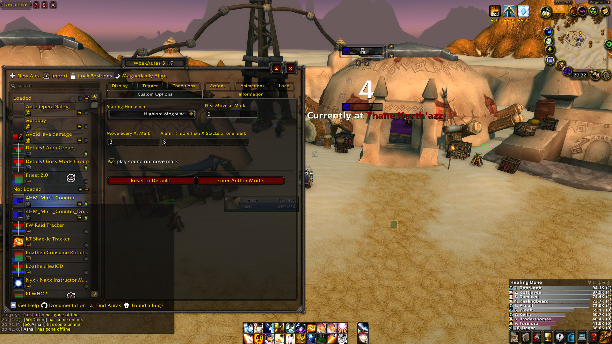

# 4 Horsemen Mark Counter (Doorknob's Edit)

Edit to a [mark counter WeakAura](https://wago.io/amLxHdF6g) adding the healer rotation based on [this strategy](https://docs.google.com/document/d/1ftQI3Tdwto-z-oPXr7WEsvlqIuGdbOKkm67IgB_h-bE/edit#heading=h.k09bjt70nku7).

## Features

The WeakAura will show which Horseman you are supposed to be moving to and which one you're currently supposed to be at.

Allows the following input;
- The starting horseman
- Starting move mark
- Amount of marks per horseman
- Maximum mark allowed mark stack
- The rotation direction through the horsemen (clockwise or counterclockwise).

It contains warning sounds for the following events;

- It is time for you to move. (Bike horn)
- You got a mark from a horseman you're not supposed to be at. (Electric shock)
- You got more marks than the maximum amount you set. (Sonar)

## Images

